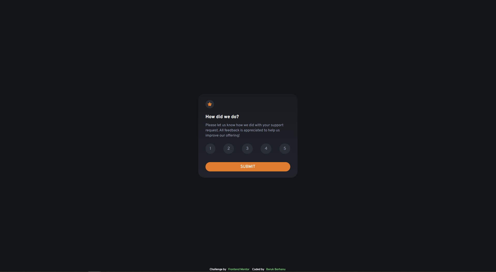
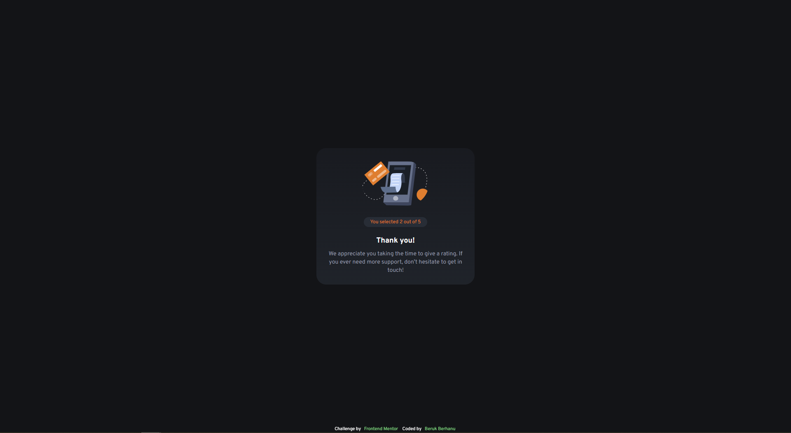

# Frontend Mentor - Interactive rating component solution

This is a solution to the [Interactive rating component challenge on Frontend Mentor](https://www.frontendmentor.io/challenges/interactive-rating-component-koxpeBUmI). Frontend Mentor challenges help you improve your coding skills by building realistic projects. 

## Table of contents

- [Overview](#overview)
  - [The challenge](#the-challenge)
  - [Screenshot](#screenshot)
  - [Links](#links)
  - [Built with](#built-with)
  - [Useful resources](#useful-resources)
- [Author](#author)

## Overview

### The challenge

Users should be able to:

- View the optimal layout for the app depending on their device's screen size
- See hover states for all interactive elements on the page
- Select and submit a number rating
- See the "Thank you" card state after submitting a rating

### Screenshot

### Links

- Solution URL: [Github Repo](https://github.com/BerukB/interactive-rating-component)
- Live Site URL: [Live Site](https://interactive-rating-component-q6p9f3usd-berukb.vercel.app/)

### Built with

- Semantic HTML5 markup
- CSS custom properties
- Flexbox
- Mobile-first workflow
- [Tailwindcss](https://tailwindcss.com/) - For styles

### Useful resources

- [Tailwind documentation](https://tailwindcss.com/) - This helped me to refer different classes of css. I really liked this pattern and will use it going forward.

## Author

- Frontend Mentor - [@BerukB](https://www.frontendmentor.io/profile/BerukB)
